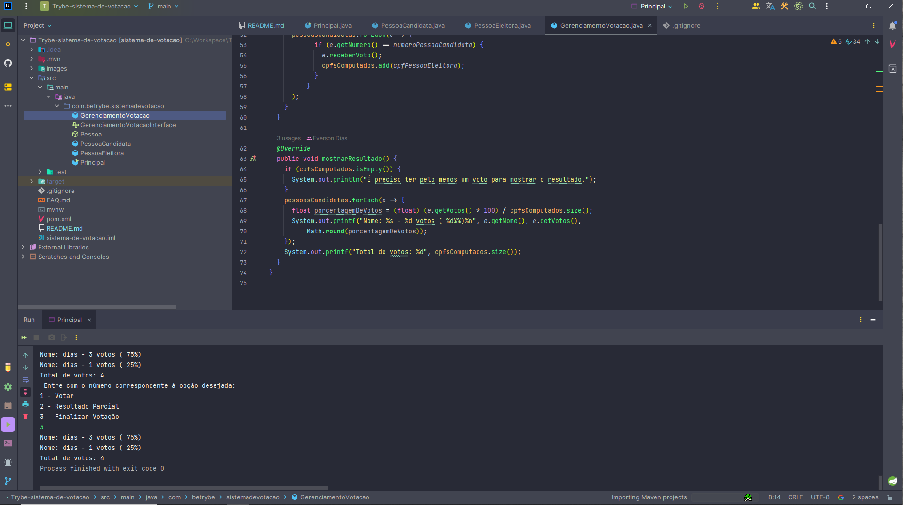

# Sistema de votação



# Índice

* [Título e Imagens Home](#sistema-de-votação)
* [tecnologias utilizadas](#tecnologias-utilizadas)
* [Descrição do projeto](#descrição-do-projeto)
* [Status do Projeto](#status-do-projeto)
* [Funcionalidade do projeto](#🔨-funcionalidade-do-projeto)
* [Acesso ao Projeto](#acesso-ao-projeto)

# Tecnologias utilizadas


# Descrição do Projeto

O projeto "Sistema de votação" é parte do currículo da formação de Desenvolvedor Web da [Trybe](https://www.betrybe.com/). Nesse projeto, os alunos têm a oportunidade de aplicar seus conhecimentos na Linguagem Java. 

# Status do Projeto

> 💹 Alpha 💹

# 🔨 Funcionalidade do projeto

- Cadastra Candidato
- Cadastra Eleitor
- Votar
- Ver a Apuração de votos

# Acesso ao projeto

Para acessar e executar este projeto, siga os passos abaixo:

1. Certifique-se de ter o JDK e o Maven instalados em sua máquina, Recomento utilizar Intellij community

2. Clone o Projeto

```bash
git clone  SistemaDeVotacao
```

3. Entre no projeto

```bash
cd SistemaDeVotacao
```

4. Instale as Dependências

O Intellij instala automaticamente.

Caso esteja com outra Ide

```bash
mvn install
```


5. inicie o projeto

Execute a Classe Pricipal.
